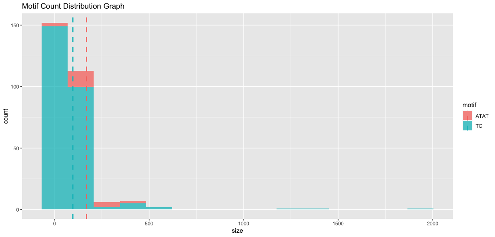
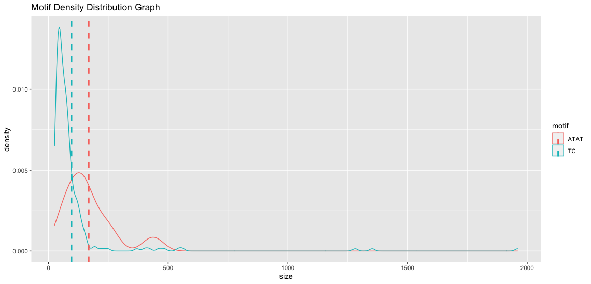
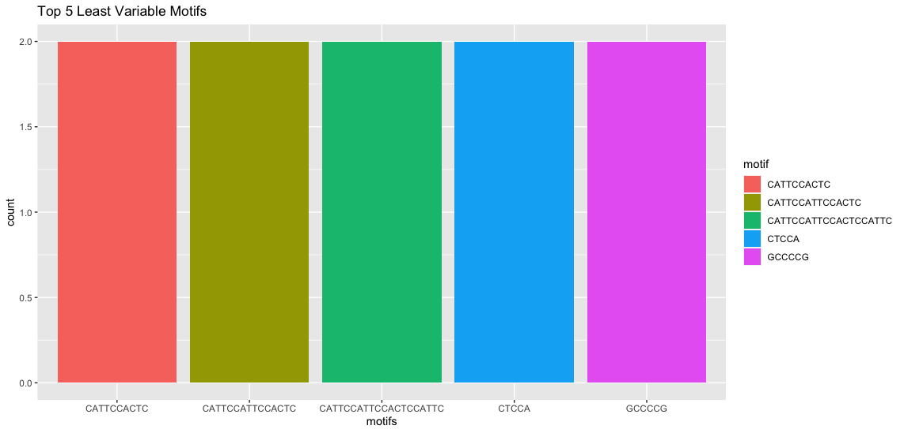
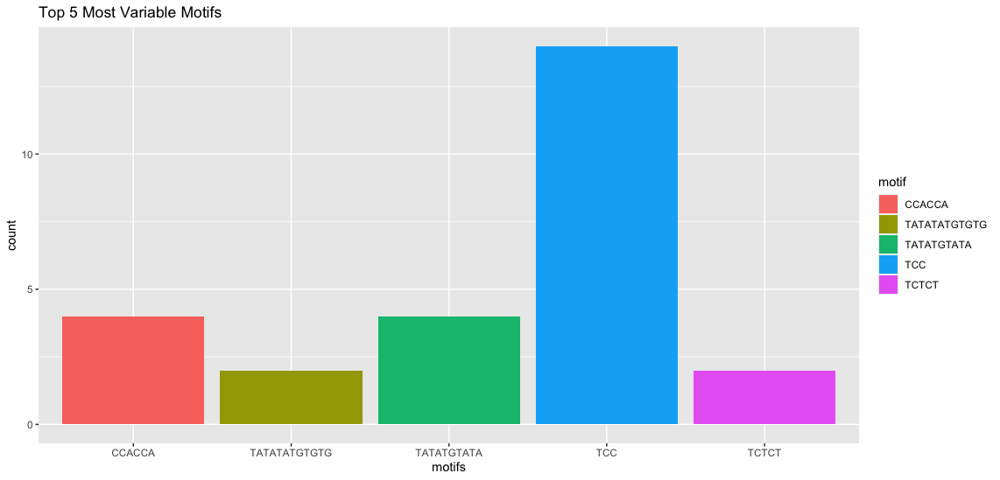

<!-- README.md is generated from README.Rmd. Please edit that file -->

```{r, include = FALSE}
knitr::opts_chunk$set(
  collapse = TRUE,
  comment = "#>",
  fig.path = "man/figures/README-",
  out.width = "100%"
)
```

# STRExpansionAnalyzer

## Background Information
Short tandem repeats (STRs) are tracts of repetitive DNA. Typically, they are
short sequences of 2-6 nucleotides repeated adjacently two or more times in a head
to tail manner<sup>3</sup>. STR loci are prone to mutations and high rates of polymorphism<sup>1</sup>. Expansions
of STR loci can be pathogenic and have been attributed to more than 40 Mendelian diseases<sup>2,4</sup>.
As well, they have been strongly linked to more complex disorders like autism spectrum syndrome<sup>3</sup>.

## Description
This package helps label short tandem repeat (STR) loci as "variable" or not (stable) for machine learning and statistical analysis.
The function *readIntoDF* takes in a text file of identified STR loci locations from any species' genome and creates a dataframe.
The function *createVariables* calculates additional measure variables using STR motifs and locations, cleans the dataset and labels each STR loci as either "variable" or not depending a user defined z-score.
The rest of the functions help graph the distribution of STR motifs, the most common/least common motifs and most variable/least variable motifs.


## Installation
To install:
```
require("devtools")
install_github("michaelzwong/STRExpansionAnalyzer", build_vignettes = TRUE)
library("STRExpansionAnalyzer")
```

## Overview
`STRExpansionAnalyzer` contains 6 functions and 1 dataset.
```{r, eval = FALSE}
ls("package:STRExpansionViewer")
data(package = "ShortTandemRepeatsLoci")
```

To load text file containing STR loci positions of any species' genome 
into a dataframe, use: *readIntoDF*.

To label loci as variable and add measure variable columns like motif mean and
sd, use: *createVariables*.

To graph distribution, see common/least common motifs, or to see variable or 
least variable motifs, use the graphing functions: *plotMotifsDistribution*, *plotTopNCommonMotifs*, *plotTopNLeastVariableMotifs*, *plotTopNMostVariableMotifs*.

*plotMotifsDistribution* Display the distribution of certain motifs



*plotTopNMostCommonMotifs* Display the common motifs


*plotTopNLeastVariableMotifs* Display the least variable or (stable) motifs


*plotTopNMostVariableMotifs* Display the most variable motifs



## Tutorials
```
browseVignettes("STRExpansionAnalyzer")
```
## Citation for Package
```
citation("STRExpansionAnalyzer")
```

## References
[1]: Gemayel, R., Vinces MD., Legendre, M., Verstrepen, K.J.. Variable tandem repeats accelerate evolution of coding and regulatory sequences. *Annu Rev Genet* 44, 445–77 (2010).

[2]:López Castel, A., Cleary, J. D. & Pearson, C. E. Repeat instability as the basis for human diseases and as a potential target for therapy. Nat. Rev. Mol. *Cell Biol*. 11, 165–170 (2010).

[3]: Trost, B., Engchuan, W., Nguyen, C.M. et al. Genome-wide detection of tandem DNA repeats that are expanded in autism. Nature 586, 80–86 (2020). https://doi.org/10.1038/s41586-020-2579-z

[4]: Hao F., Chu J. A Brief Review of Short Tandem Repeat Mutation. Genomics, *Proteomics & Bioinformatics*. 5, 7-14 (2007). https://doi.org/10.1016/S1672-0229(07)60009-6.

[5] Church, D. M., Schneider, V. A., Graves, T., Auger, K., Cunningham, F., Bouk, N., Chen, H. C., Agarwala, R., McLaren, W. M., Ritchie, G. R., Albracht, D., Kremitzki, M., Rock, S., Kotkiewicz, H., Kremitzki, C., Wollam, A., Trani, L., Fulton, L., Fulton, R., Matthews, L., … Hubbard, T. (2011). Modernizing reference genome assemblies. *PLoS biology*, 9(7), e1001091. https://doi.org/10.1371/journal.pbio.1001091

[6] Schneider, V. A., Graves-Lindsay, T., Howe, K., Bouk, N., Chen, H. C., Kitts, P. A., Murphy, T. D., Pruitt, K. D., Thibaud-Nissen, F., Albracht, D., Fulton, R. S., Kremitzki, M., Magrini, V., Markovic, C., McGrath, S., Steinberg, K. M., Auger, K., Chow, W., Collins, J., Harden, G., … Church, D. M. (2017). Evaluation of GRCh38 and de novo haploid genome assemblies demonstrates the enduring quality of the reference assembly. *Genome research*, 27(5), 849–864. https://doi.org/10.1101/gr.213611.116

[7] Dolzhenko, E., van Vugt, J., Shaw, R. J., Bekritsky, M. A., van Blitterswijk, M., Narzisi, G., Ajay, S. S., Rajan, V., Lajoie, B. R., Johnson, N. H., Kingsbury, Z., Humphray, S. J., Schellevis, R. D., Brands, W. J., Baker, M., Rademakers, R., Kooyman, M., Tazelaar, G., van Es, M. A., McLaughlin, R., … Eberle, M. A. (2017). Detection of long repeat expansions from PCR-free whole-genome sequence data. *Genome research*, 27(11), 1895–1903. https://doi.org/10.1101/gr.225672.117

[8] Dolzhenko, E., Deshpande, V., Schlesinger, F., Krusche, P., Petrovski, R., Chen, S., Emig-Agius, D., Gross, A., Narzisi, G., Bowman, B., Scheffler, K., van Vugt, J., French, C., Sanchis-Juan, A., Ibáñez, K., Tucci, A., Lajoie, B. R., Veldink, J. H., Raymond, F. L., Taft, R. J., … Eberle, M. A. (2019). ExpansionHunter: a sequence-graph-based tool to analyze variation in short tandem repeat regions. *Bioinformatics* (Oxford, England), 35(22), 4754–4756. https://doi.org/10.1093/bioinformatics/btz431

[9] Benson G. (1999). Tandem repeats finder: a program to analyze DNA sequences. *Nucleic acids research*, 27(2), 573–580. https://doi.org/10.1093/nar/27.2.573

[10] C Yuen, R., Merico, D., Bookman, M. et al. Whole genome sequencing resource identifies 18 new candidate genes for autism spectrum disorder. *Nat Neurosci* 20, 602–611 (2017). https://doi.org/10.1038/nn.4524

[11] Trost, B., Engchuan, W., Nguyen, C.M. et al. Genome-wide detection of tandem DNA repeats that are expanded in autism. *Nature* 586, 80–86 (2020). https://doi.org/10.1038/s41586-020-2579-z

[12] R Core Team (2020). R: A language and environment for statistical 
computing. *R Foundation for Statistical Computing*, Vienna, Austria. URL https://www.R-project.org/.

[13] H. Wickham. ggplot2: Elegant Graphics for Data Analysis. *Springer-Verlag*
New York, 2016.

[14] Hadley Wickham and Jim Hester (2020). readr: Read Rectangular Text Data.
R package version 1.4.0. https://CRAN.R-project.org/package=readr

## Maintainer
* Michael Wong (michaelz.wong@mail.utoronto.ca)

## Acknowledgements

This package was developed as part of an assessment for 2020 BCB410H: Applied Bioinformatics, University of Toronto, Toronto, CANADA

## Contributions
* This package welcomes issues, improvement requests, and contributions. Please use [issues](https://github.com/michaelzwong/STRExpansionAnalyzer/issues) section
