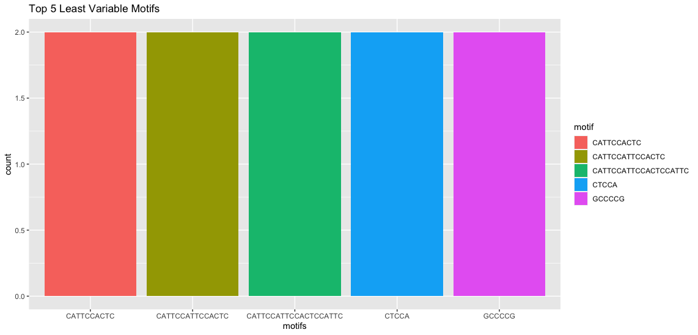
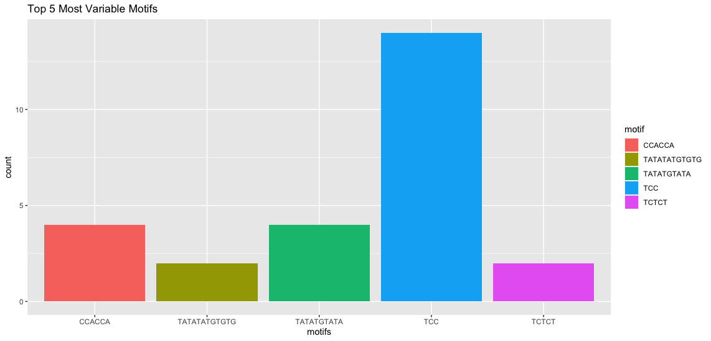
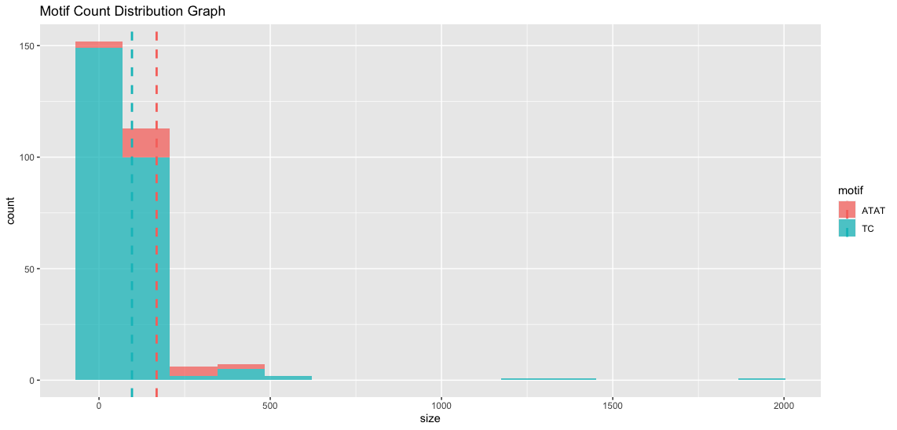
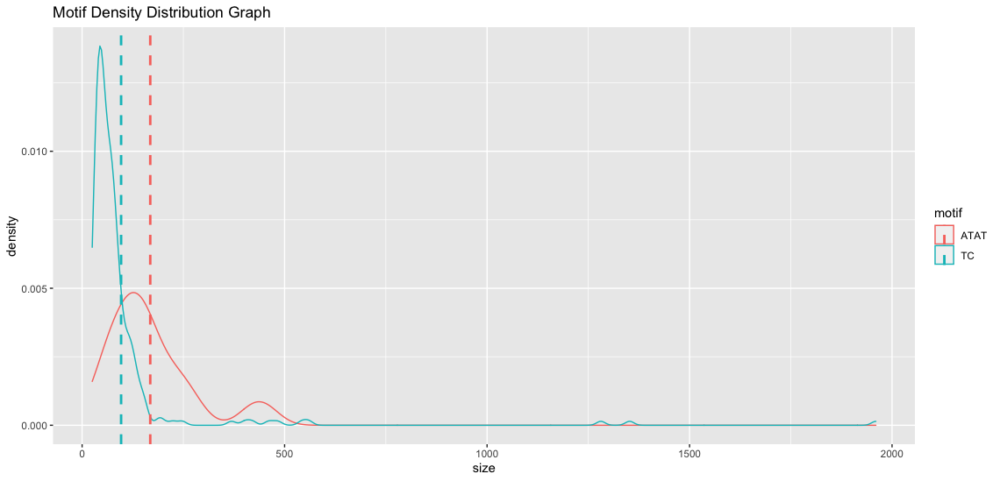

```{r, include = FALSE}
knitr::opts_chunk$set(
  collapse = TRUE,
  comment = "#>"
)
```

# Overview
This package was created for users to find out more information in
about size and motif distributions in their short tandem repeat (STR) dataset
and label the STR loci as either variable or not variable.

# Datasets
1. There is 1 dataset containing short tandem repeats in the GRCH38 human genome assembly (Genome Reference Consortium Human Build 38)^1,2^. The dataset was obtained in a separate workflow by running the ExpansionHunter^3,4^ algorithm on tandem repeats identified by Tandem Repeats Finder^5^ program as part of research on short tandem repeat expansions^7,8^. Note that this separate workflow is an intensive CPU task usually done on a cloud computer platform.

2. You can also choose to provide your own dataset of short tandem repeats in any the genome of any species. Ensure that the dataset is in a .txt file each STR is of the format chrNUMBER:STARTPOSITION-ENDPOSITION:MOTIF and are separated by tabs. 

# Workflow

1. Get a text file containing chromosome positions of STRs from a genome. The
sample file str_data.txt in the inst/extdata folder contains STRs from the hg38 human genome^1,2^. You can use that with the system.file command below.
2. Load the data in the text file into a dataframe using `readIntoDF()`
3. Create measure variables and label each STR locus as variable or not using
`createVariables()`. The zscore you specify here will determine how each locus will be
labelled. Feel free to play around, but typically use a zscore <= 0.1.

```{eval=TRUE, echo=TRUE}
  # step 1
  fpath <- system.file("extdata", "str_data.txt", package="STRExpansionAnalyzer")
  # step 2
  mydf <- STRExpansionAnalyzer::readIntoDF(fpath)
  # step 3
  mydf <- STRExpansionAnalyzer::createVariables(mydf, 0.1)
```

Alternative to steps 1-3. You can also use the dataset provided in the package. This is the same
data as the one in str_data.txt above.

```{eval=TRUE, echo=TRUE}
  # step 1 and 2. Loads the dataset into variable ShortTandemRepeatsLoci
  data("ShortTandemRepeatsLoci")
  # step 3
  mydf <- STRExpansionAnalyzer::createVariables(ShortTandemRepeatsLoci, 0.1)
```

4. Use the result dataframe to do your own analysis. or you can use some of the visualization
functions (`plotMotifsDistribution()`, `plotTopNMostVariableMotifs()`, `plotTopNLeastVariableMotifs`, `plotTopNCommonMotifs()`) provided

```{eval=TRUE, echo=TRUE}
  # plot top 5 most common motifs
  STRExpansionAnalyzer::plotTopNCommonMotifs(mydf, 5)
  # plot top 5 most common motifs with stacked style plot
  STRExpansionAnalyzer::plotTopNCommonMotifs(mydf, 5, stacked=TRUE)
  # plot size distribution of motifs ATAT and AT
  STRExpansionAnalyzer::plotMotifsDistribution(mydf, c("ATAT","AT"))
  # plot density distribution of motifs ATAT and AT
  STRExpansionAnalyzer::plotMotifsDistribution(mydf, c("ATAT","AT"), count=FALSE)
  # plot top 5 least variable motifs
  STRExpansionAnalyzer::plotTopNLeastVariableMotifs(mydf, 5)
  # plot top 5 most variable motifs
  STRExpansionAnalyzer::plotTopNMostVariableMotifs(mydf, 5)
```

The outputs of the graphs are shown below as examples.







# References
1. Church, D. M., Schneider, V. A., Graves, T., Auger, K., Cunningham, F., Bouk, N., Chen, H. C., Agarwala, R., McLaren, W. M., Ritchie, G. R., Albracht, D., Kremitzki, M., Rock, S., Kotkiewicz, H., Kremitzki, C., Wollam, A., Trani, L., Fulton, L., Fulton, R., Matthews, L., … Hubbard, T. (2011). Modernizing reference genome assemblies. PLoS biology, 9(7), e1001091. https://doi.org/10.1371/journal.pbio.1001091

2. Schneider, V. A., Graves-Lindsay, T., Howe, K., Bouk, N., Chen, H. C., Kitts, P. A., Murphy, T. D., Pruitt, K. D., Thibaud-Nissen, F., Albracht, D., Fulton, R. S., Kremitzki, M., Magrini, V., Markovic, C., McGrath, S., Steinberg, K. M., Auger, K., Chow, W., Collins, J., Harden, G., … Church, D. M. (2017). Evaluation of GRCh38 and de novo haploid genome assemblies demonstrates the enduring quality of the reference assembly. Genome research, 27(5), 849–864. https://doi.org/10.1101/gr.213611.116

4. Dolzhenko, E., van Vugt, J., Shaw, R. J., Bekritsky, M. A., van Blitterswijk, M., Narzisi, G., Ajay, S. S., Rajan, V., Lajoie, B. R., Johnson, N. H., Kingsbury, Z., Humphray, S. J., Schellevis, R. D., Brands, W. J., Baker, M., Rademakers, R., Kooyman, M., Tazelaar, G., van Es, M. A., McLaughlin, R., … Eberle, M. A. (2017). Detection of long repeat expansions from PCR-free whole-genome sequence data. Genome research, 27(11), 1895–1903. https://doi.org/10.1101/gr.225672.117

5. Dolzhenko, E., Deshpande, V., Schlesinger, F., Krusche, P., Petrovski, R., Chen, S., Emig-Agius, D., Gross, A., Narzisi, G., Bowman, B., Scheffler, K., van Vugt, J., French, C., Sanchis-Juan, A., Ibáñez, K., Tucci, A., Lajoie, B. R., Veldink, J. H., Raymond, F. L., Taft, R. J., … Eberle, M. A. (2019). ExpansionHunter: a sequence-graph-based tool to analyze variation in short tandem repeat regions. Bioinformatics (Oxford, England), 35(22), 4754–4756. https://doi.org/10.1093/bioinformatics/btz431

6. Benson G. (1999). Tandem repeats finder: a program to analyze DNA sequences. Nucleic acids research, 27(2), 573–580. https://doi.org/10.1093/nar/27.2.573

7. C Yuen, R., Merico, D., Bookman, M. et al. Whole genome sequencing resource identifies 18 new candidate genes for autism spectrum disorder. Nat Neurosci 20, 602–611 (2017). https://doi.org/10.1038/nn.4524

8. Trost, B., Engchuan, W., Nguyen, C.M. et al. Genome-wide detection of tandem DNA repeats that are expanded in autism. Nature 586, 80–86 (2020). https://doi.org/10.1038/s41586-020-2579-z

9. R Core Team. 2020. R: A language and environment for statistical computing. R Foundation for Statistical Computing, Vienna, Austria. URL: https://www.R-project.org/.


